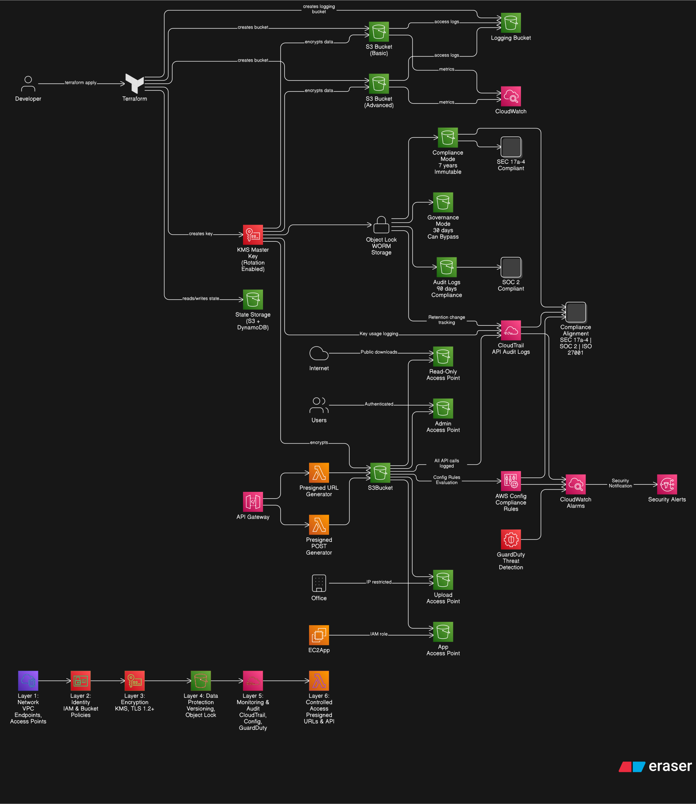

# 🛡️ S3 Security Fortress

> **A production-grade, multi-layered S3 security implementation using Terraform**

[](https://www.terraform.io/)
[](https://aws.amazon.com/)
[](LICENSE)

## 📋 Table of Contents
- [Overview](#overview)
- [Architecture](#architecture)
- [Features](#features)
- [Security Layers](#security-layers)
- [Quick Start](#quick-start)
- [Project Structure](#project-structure)
- [Prerequisites](#prerequisites)
- [Installation](#installation)
- [Usage Examples](#usage-examples)
- [Testing](#testing)
- [Compliance](#compliance)
- [Cost Estimation](#cost-estimation)
- [Contributing](#contributing)
- [Documentation](#documentation)
- [License](#license)

## 🎯 Overview
**S3 Security Fortress** is a comprehensive reference implementation demonstrating enterprise-grade security practices for Amazon S3. This project showcases how to build a defense-in-depth approach to cloud storage security using Infrastructure as Code.
This project demonstrates real-world cloud security engineering patterns used in regulated production environments.

### **What Problem Does This Solve?**
S3 misconfigurations are a leading cause of data breaches. This project demonstrates:
- ✅ How to implement security at every layer
- ✅ Compliance-ready configurations (SOC2, HIPAA, PCI-DSS)
- ✅ Automated security testing and validation
- ✅ Production-ready patterns and best practices

### **Who Is This For?**
- 🎓 **Cloud Engineers** learning AWS security best practices
- 🏢 **DevOps Teams** implementing secure infrastructure
- 📊 **Security Auditors** evaluating S3 configurations
- 💼 **Compliance Officers** mapping security controls

## ✨ Features
### **🔐 Security Features**
| Feature | Description | Status |
|--------------------|-----------------------------------------------|----------------|
| **KMS Encryption** | Customer-managed keys with automatic rotation | ✅ Implemented |
| **Access Points**  | VPC-restricted access with dedicated policies | ✅ Implemented |
| **Object Lock**    | WORM storage with governance/compliance modes | ✅ Implemented |
| **Presigned URLs** | Time-limited, secure access generation        | ✅ Implemented |
| **Block Public Access** | All four settings enabled by default     | ✅ Implemented |
| **MFA Delete**     | Require MFA for object deletion               | ✅ Implemented |
| **Versioning**     | Protect against accidental deletion           | ✅ Implemented |

### **📊 Monitoring & Compliance**
- **CloudTrail Integration**: Complete audit trail of API calls
- **S3 Access Logging**: Track all access requests
- **CloudWatch Alarms**: Real-time alerting on security events
- **AWS Config Rules**: Continuous compliance monitoring
- **EventBridge Integration**: Automated response to security events

### **🛠️ Developer Experience**
- **Modular Design**: Reusable Terraform modules
- **Automated Testing**: Unit, integration, and security tests
- **CI/CD Ready**: GitHub Actions workflows included
- **Cost Optimization**: Built-in cost estimation
- **Comprehensive Docs**: Architecture diagrams, runbooks, ADRs

## 🔒 Security Layers

### **Layer 1: Network Security**
```terraform
# VPC-restricted S3 Access Point
resource "aws_s3_access_point" "secure" {
  name   = "secure-data-access"
  bucket = aws_s3_bucket.main.id

  vpc_configuration {
    vpc_id = var.vpc_id
  }
}
```

### **Layer 2: Identity & Access Management**
- Least privilege IAM policies
- Bucket policies enforcing encryption
- Access point policies for fine-grained control

### **Layer 3: Encryption**
- KMS customer-managed keys
- Automatic key rotation
- Encryption in transit (TLS only)
- Encryption at rest (mandatory)

### **Layer 4: Data Protection**
- Object Lock (WORM storage)
- Versioning enabled
- MFA delete protection
- Cross-region replication (optional)

### **Layer 5: Auditing & Monitoring**
- CloudTrail data events
- S3 access logs
- CloudWatch metrics
- Real-time alerting

## 🚀 Quick Start

### **1. Clone the Repository**
```bash
git clone https://github.com/yourusername/s3-security-fortress.git
cd s3-security-fortress
```

### **2. Install Prerequisites**
```bash
# Run automated setup
./scripts/setup/install-prerequisites.sh

# Or install manually:
# - Terraform >= 1.6
# - AWS CLI >= 2.0
# - Go >= 1.21 (for testing)
```

### **3. Configure AWS Credentials**
```bash
aws configure
# Enter your AWS Access Key ID
# Enter your AWS Secret Access Key
# Default region: us-east-1
```

### **4. Initialize Terraform Backend**
```bash
# Setup S3 backend for state management
cd terraform/backend-setup
terraform init
terraform apply
```

### **5. Deploy Your First Secure Bucket**
```bash
cd terraform/environments/dev
terraform init
terraform plan
terraform apply
```


## 🏗️ Architecture



## 📁 Project Structure
```
s3-security-fortress/
├── Makefile
├── README.md
└── terraform/
    ├── backend-setup/              # Remote state configuration
    ├── modules/
    │   ├── kms-encryption/         # KMS CMK + rotation
    │   ├── secure-s3-bucket/       # Versioning, logging, MFA delete
    │   ├── s3-access-points/       # Fine-grained access isolation
    │   ├── object-lock/            # Compliance + governance WORM storage
    │   ├── presigned-access/       # API Gateway + Lambda presigned URLs
    │   └── monitoring-compliance/  # CloudTrail, Config, CloudWatch
    └── examples/
        └── complete-integration/   # End-to-end deployment
```


## 📋 Prerequisites
### **Required**
- AWS Account with appropriate permissions
- Terraform >= 1.6.0
- AWS CLI >= 2.0
- Basic understanding of AWS S3 and IAM

### **Optional (for testing)**
- Go >= 1.21 (for Terratest)
- Python >= 3.9 (for Lambda testing)
- Docker (for local testing)

### **AWS Permissions Required**
- S3 full access (or specific bucket permissions)
- KMS key management
- IAM policy management
- CloudTrail access
- CloudWatch Logs access

## 💻 Usage Examples

### **Example 1: Basic Secure Bucket**
```bash
cd examples/basic-secure-bucket
terraform init
terraform apply
```

### **Example 2: Multi-Region Setup**
```bash
cd examples/multi-region-setup
terraform init
terraform apply
```

### **Example 3: Healthcare Compliance (HIPAA)**
```bash
cd examples/healthcare-compliance
terraform init
terraform apply
```

### **Example 4: Generate Presigned URL**
```bash
# Using provided script
./scripts/utilities/generate-presigned-url.sh \
  --bucket my-secure-bucket \
  --key sensitive-file.pdf \
  --expiration 3600
```

## 🧪 Testing
### **Run All Tests**
```bash
make test
```

### **Run Security Scans**
```bash
make security-scan
```

### **Run Specific Test Suite**
```bash
# Unit tests
cd tests/terraform/unit
go test -v

# Integration tests
cd tests/terraform/integration
go test -v -timeout 30m
```

### **Validate Terraform**
```bash
make validate
```

## 📊 Compliance

This project maps security controls to major compliance frameworks:

| Framework | Requirement             | Documentation                                          |
|-----------|-------------------------|--------------------------------------------------------|
| **GDPR**  | Art. 32 (Encryption)    | Enforced via KMS SSE-KMS in `modules/secure-s3-bucket` |
| **HIPAA** | §164.312 (Access)       | Restricted via IAM Roles & SigV4 in `modules/presigned-access` |
| **SOC 2** | CC7.2 (Monitoring)      |  CloudWatch Alarms & Config Rules in `modules/monitoring-compliance` |
| **PCI-DSS** | Req. 3.4 (Protection) | Object Lock & Versioning in `modules/object-lock` |


## 💰 Cost Estimation
### **Monthly Cost Breakdown (Single Environment)**

| Service    | Cost      | Notes                   |
|------------|-----------|-------------------------|
| KMS Key    | $1.00     | One key per environment |
| S3 Storage | $0.023/GB | First 5GB free          |
| KMS API Calls| $0.03/10k | First 20k free/month  |
| CloudTrail | Free      | First trail free        |
| S3 Requests| Variable  | PUT: $0.005/1k,GET: $0.0004/1k |

**Estimated Dev Environment: $1-2/month**
**Estimated Prod Environment: $5-15/month** (depending on usage)

## 🤝 Contributing

We welcome contributions!

### **How to Contribute**
1. Fork the repository
2. Create a feature branch (`git checkout -b feature/amazing-feature`)
3. Commit your changes using Conventional Commits: (`git commit -m 'Add amazing feature'`)
4. Push to the branch (`git push origin feature/amazing-feature`)
5. Open a Pull Request

#### **Commit Message Standards**
We use the following prefixes to keep our audit trail clear:
1. feat: A new security feature or resource.
2. fix: A bug fix in Terraform or Lambda code.
3. docs: Documentation changes only.
4. refactor: Code changes that neither fix bugs nor add features.
5. chore: Maintenance tasks (e.g., updating .gitignore).

## 📚 Documentation

| Document | Description |
|----------|-------------|
| [Architecture Overview](docs/architecture/overview.md) | High-level system design |
| [Security Controls](docs/security-controls/controls-matrix.md) | Complete security controls |
| [Deployment Guide](docs/runbooks/deployment.md) | Step-by-step deployment |
| [Troubleshooting](docs/runbooks/troubleshooting.md) | Common issues and solutions |
| [API Documentation](docs/api/presigned-urls.md) | Presigned URL API reference |
| [ADRs](docs/architecture/adr/) | Architecture decisions |

---

## 📝 License

This project is licensed under the MIT License - see the [LICENSE](LICENSE) file for details.

---

## 🙏 Acknowledgments

- AWS Security Best Practices documentation
- Terraform AWS Provider documentation
- Cloud Security Alliance guidelines
- OWASP Cloud Security project

## ⭐ Star History

If you find this project useful, please consider giving it a star! ⭐

---

**Built with ❤️ for the cloud security community**
